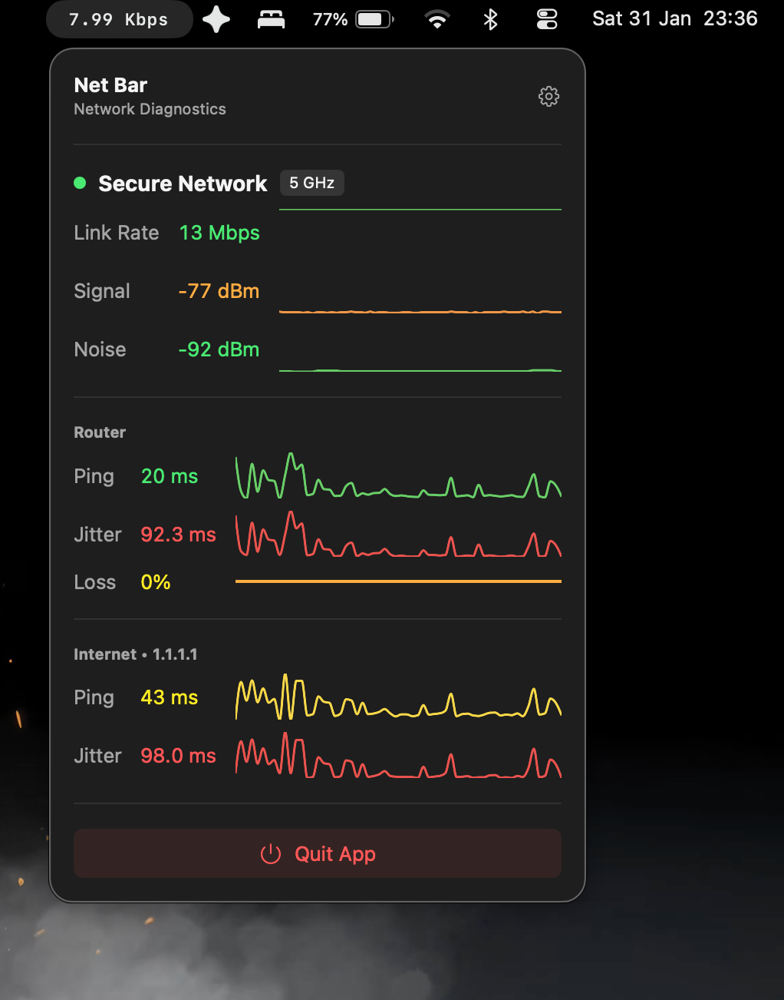

# Net Bar

<p align="center">
  
</p>

<p align="center">
  
  
  
</p>

<p align="center">
  <b>A lightweight, aesthetically pleasing network speed monitor that lives in your macOS menu bar.</b>
  <br>
  Real-time download/upload speeds • Detailed diagnostics • Fully customizable
</p>

## Screenshots

<p align="center">
  
</p>

## Features

- **Real-time Monitoring**: View current download and upload speeds directly in your menu bar.
- **Detailed Stats**: Click the menu bar icon to see rich diagnostics:
  - **Wi-Fi Details**: SSID, Link Rate, Signal Strength, and Noise graphs.
  - **Latency**: Continuous Ping and Jitter monitoring to your router and the internet (1.1.1.1).
- **Customizable**:
  - **Typography**: Adjust font size, line spacing, and kerning.
  - **Display Modes**: Show download, upload, or both.
  - **Units**: Switch between Bytes (MB/s) and Bits (Mbps).
  - **Appearance**: Toggle direction arrows and more.
- **Native Experience**: Built with SwiftUI and AppKit for seamless macOS integration.

## Installation

### From Source

1.  **Clone the repository**:
    ```bash
    git clone https://github.com/iad1tya/Net-Bar
    cd Net-Bar
    ```

2.  **Build and Install**:
    Run the following command in your terminal to build the app and install it to your Applications folder:

    ```bash
    swift build -c release && \
    rm -rf "Net Bar.app" && \
    BIN_PATH=$(swift build -c release --show-bin-path) && \
    mkdir -p "Net Bar.app/Contents/MacOS" && \
    mkdir -p "Net Bar.app/Contents/Resources" && \
    cp "$BIN_PATH/NetBar" "Net Bar.app/Contents/MacOS/NetBar" && \
    cp Sources/NetSpeedMonitor/Info.plist "Net Bar.app/Contents/Info.plist" && \
    cp Sources/NetSpeedMonitor/Resources/AppIcon.icns "Net Bar.app/Contents/Resources/AppIcon.icns" && \
    cp -r Sources/NetSpeedMonitor/Assets.xcassets "Net Bar.app/Contents/Resources/" && \
    rm -rf "/Applications/Net Bar.app" && \
    mv "Net Bar.app" /Applications/
    ```

3.  **Run**:
    Open "Net Bar" from your Applications folder.

## Requirements

- macOS 14.0 (Sonoma) or later.

## Support

If you enjoy **Net Bar**, please consider supporting the development!

<div align="center">

<a href="https://www.buymeacoffee.com/iad1tya" target="_blank">
  
</a>


| Currency | Address |
| :--- | :--- |
| **Bitcoin (BTC)** | `bc1qcvyr7eekha8uytmffcvgzf4h7xy7shqzke35fy` |
| **Ethereum (ETH)** | `0x51bc91022E2dCef9974D5db2A0e22d57B360e700` |
| **Solana (SOL)** | `9wjca3EQnEiqzqgy7N5iqS1JGXJiknMQv6zHgL96t94S` |


[Visit Support Website](https://support.iad1tya.cyou)

</div>
